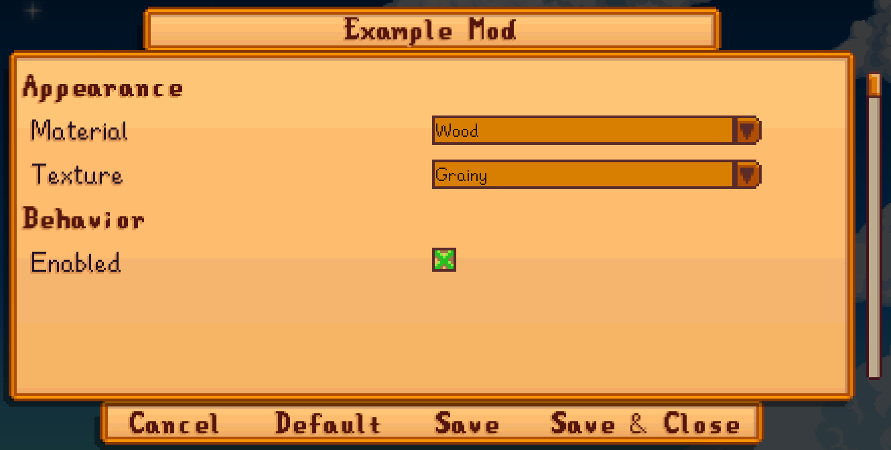

**Content Patcher** is a [Stardew Valley](http://stardewvalley.net/) mod which loads content packs
to change the game's data, images, and maps without replacing game files.

## Contents
* [For players](#for-players)
  * [Install](#install)
  * [Compatibility](#compatibility)
  * [Configure content packs](#configure-content-packs)
  * [Multiplayer](#multiplayer)
* [For mod authors](#for-mod-authors)
* [See also](#see-also)

## For players
### Install
1. [Install the latest version of SMAPI](https://smapi.io/).
2. Install [this mod from Nexus Mods](https://www.nexusmods.com/stardewvalley/mods/1915).
3. Unzip any Content Patcher content packs into `Mods` to install them.
4. Run the game using SMAPI.

That's it! Content packs unzipped into `Mods` will be loaded and applied automatically.

### Compatibility
Content Patcher is compatible with Stardew Valley 1.5+ on Linux/Mac/Windows, both single-player and
multiplayer.

### Configure content packs
Many content packs can be configured using a `config.json` file, which Content Patcher will create
the first time you launch the game with that content pack installed. (If no `config.json` appears,
the mod probably isn't configurable.)

If you have [Generic Mod Config Menu](https://www.nexusmods.com/stardewvalley/mods/5098) installed,
Content Patcher will automatically add configurable content packs to its in-game menu:



### Multiplayer
Content Patcher works fine in multiplayer. It's best if all players have the same content packs,
but not required. Here are the effects if some players don't have a content pack installed:

patch type | effect
---------- | ------
visual     | Only visible to players that have it installed.
maps       | Only visible to players that have it installed. Players without the custom map will see the normal map and will be subject to the normal bounds (e.g. they may see other players walk through walls, but they won't be able to follow).
data       | Only directly affects players that have it installed, but can indirectly affect other players. For example, if a content pack changes `Data/ObjectInformation` and you create a new object, other player will see that object's custom values even if their `Data/ObjectInformation` doesn't have those changes.

## For mod authors
* To create content packs, see the [author guide](author-guide.md) and its [tokens subpage](author-guide/tokens.md).
* To add custom Content Patcher tokens from a SMAPI mod, see the [extensibility API](extensibility.md).
* To use Content Patcher conditions in your own SMAPI mod, see the [conditions API](conditions-api.md).


## Configure
Content Patcher creates a `config.json` file in its mod folder the first time you run it. You can
open that file in a text editor to configure the mod.

These are the available settings:

<table>
<tr>
  <th>setting</th>
  <th>what it affects</th>
</tr>

<tr>
  <td><code>EnableDebugFeatures</code></td>
  <td>

Default `false`. Whether to enable [debug features meant for content pack creators](author-guide/troubleshooting.md#debug-mode).

  </td>
</tr>

<tr>
  <td><code>GroupEditsByMod</code></td>
  <td>

Default `true`. Whether to apply changes from each content pack in a separate operation. This has
two main benefits:

* SMAPI logs will show the content pack name to simplify troubleshooting. For example:
  ```
  when true:
      Content Patcher edited Characters/Abigail (for the 'Abigail Wears a Bow' content pack).
      Content Patcher edited Characters/Abigail (for the 'Fancy Abigail' content pack).

  when false:
      Content Patcher edited Characters/Abigail.
  ```
* If applying changes from one content pack fails due to an error, changes from other content packs
  will still be applied.

If you have a large number of content packs and are noticing lag spikes in-game, you can try
disabling this to improve performance. If you do, make sure to re-enable it before sharing your
SMAPI log when asking for help.

  </td>
</tr>

<tr>
  <td><code>Controls</code></td>
  <td>

The configured controller, keyboard, and mouse buttons (see [key bindings](https://stardewvalleywiki.com/Modding:Key_bindings)).
The default button bindings are...

* `F3` to show the [debug overlay](author-guide/troubleshooting.md#debug-mode) (if enabled);
* `LeftControl` and `RightControl` to switch textures in the debug overlay.

You can separate bindings with commas (like `B, LeftShoulder` for either one), and set multi-key
bindings with plus signs (like `LeftShift + B`).

  </td>
</tr>
</table>

## See also
* [Release notes](release-notes.md)
* [Nexus mod](https://www.nexusmods.com/stardewvalley/mods/1915)
* [Ask for help](https://stardewvalleywiki.com/Modding:Help)
